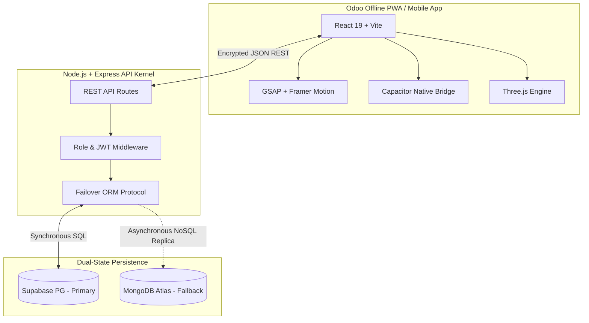

<div align="center">


# 🚀 The Ultimate PLM Ecosystem
**Next-Generation Product Lifecycle & Engineering Change Control Matrix**

[](https://reactjs.org/)
[](https://nodejs.org/)
[](https://supabase.com/)
[](https://mongodb.com/)
[](https://capacitorjs.com/)
[](https://tailwindcss.com/)
[](https://threejs.org/)

*An ultra-modern, fault-tolerant Product Lifecycle Management (PLM) platform engineered with uncompromising aesthetic precision, dual-database sync technology, and native cross-platform deployment. It’s what happens when enterprise software meets visceral, consumer-grade beauty.*

---

</div>

<br />

## 🌍 Why PLM? (Product Lifecycle Management)

Building a hardware product, orchestrating a complex supply chain, or managing hundreds of interlocking Engineering Change Orders (ECOs) is notoriously chaotic. **PLM is the absolute source of truth**—a unified central nervous system that brings order to the chaos.

Without PLM, companies exist in pure organizational anarchy:
- Different iterations of files floating around in emails.
- Engineering teams using "Final_Final_v3.pdf" while manufacturing uses "Final_Final_v4.pdf".
- No traceability over who approved a multi-million-dollar change to a Bill of Materials (BoM).

PLM eliminates this. It enforces strict **revision control**, ensures seamless communication between engineering and manufacturing lines, guarantees **audit trails**, and drives product time-to-market down radically.

---

## 💀 The Death of Spreadsheets (PLM vs. Excel)

Historically, startups and legacy teams manage Bills of Materials and change orders on Excel or Google Sheets. **This is a ticking time bomb.**

| Feature / Trait | 📊 Microsoft Excel / Sheets | 🚀 This PLM System |
| :--- | :--- | :--- |
| **Data Integrity** | Fragile. Cells get accidentally deleted or overwritten. | Absolute. Relational DB schema with strict ACID properties. |
| **Revision Control** | Manual copying via "save as". Nightmarish to track diffs. | Automated visual & parametric diffs built right into the ECO pipeline. |
| **Audit Trails** | Non-existent. No one knows *who* changed a component at 3 AM. | Cryptographic JWT logging. Complete, immutable chronological history. |
| **Access Control** | Everyone edits everything, or locked cells cause friction. | Advanced Role-Based (Admin, Engineer, Approver, Operations). |
| **SLA & Approvals** | Emails go unread. Bottlenecks happen silently. | Live countdown timers, automated escalations, and 1-click approvals. |
| **Data Visualization** | Boring rows and columns. | Interactive 3D component renders via Three.js and real-time SLA dials. |

Stop running enterprise hardware on glorified calculators. Welcome to the future.

---

## ✨ God-Level Features

- 🛡️ **Dual-Database Failover Architecture**: Runs natively on **Supabase PostgreSQL** holding relational truth, with an automatic, instantaneous synchronization pipeline to **MongoDB Atlas**. If Postgres goes dark, Mongo serves the UI seamlessly.
- 📱 **Native Capacitor Builds**: Not just a web app. Compiles to native iOS and Android binaries instantly (`npm run android:apk`), shipping the PLM right into your manufacturing floor personnel's pockets.
- ⚡ **Real-Time SLA Engine**: Built-in service level agreement countdowns. Engineering delays glow red across the dashboard.
- 🎨 **Cinematic Glassmorphic UI**: Engineered with `@gsap/react`, `framer-motion`, and Tailwind V4. Transitions between components don't just load; they *flow*.
- 📐 **Interactive 3D Visualizer**: View components in 360 space right in the browser using `@react-three/fiber` and `drei`.
- 🔐 **Intelligent Multi-Tier Auth**: Strictly partitions functions between `Admin`, `Engineering`, and `Operations`.
- 📧 **Serverless Email Onboarding**: Non-blocking asynchronous credential dispatch via `@emailjs/browser`—bypassing traditional SMTP headaches.
- 📄 **On-the-Fly PDF Intelligence**: Leveraging `jspdf-autotable`, the system rips complex, multi-tiered ECO schemas and auto-compiles them into stunning PDF manifestos for immediate boardroom distribution.
- 🖼️ **Hyper-Granular Visual Diffing**: In-line visual and mathematical deviation analysis for every BOM update. 

---

## 🏗️ Architectural Masterpiece

The system logic separates high-frequency read/writes from heavy asset processing:



---

## 📂 Repository Matrix

This repo is a precisely structured monorepo designed for extreme scalability.

### 🎨 Frontend (`/Frontend`)
```text
├── src/
│   ├── assets/        # SVGs, Icons, and global image assets
│   ├── components/    # Reusable atomic UI elements (Buttons, Tables, ECO Differs)
│   ├── context/       # Global React Context (Auth State, Theme, Language)
│   ├── pages/         # Full-screen macro views (Dashboard, Products, BOMs)
│   ├── hooks/         # Custom React hooks (useAuth, useSLA, useTheme)
│   ├── i18n/          # Internationalization bindings
│   ├── services/      # API communication layer and EmailJS scripts
│   ├── styles/        # Tailwind utility overlays and CSS variables
│   └── utils/         # Pure helper functions (PDF Generation, Formatting)
├── android/           # Capacitor generated Android native environment
└── package.json       # React 19, Capacitor 8, GSAP, Tailwind 4 config
```

### 🧠 Backend (`/backend`)
```text
├── src/
│   ├── config/        # Dual-DB connection initializers (pg & mongoose settings)
│   ├── middleware/    # Auth validators, role checks, and error boundaries
│   ├── routes/        # Express routers mapping HTTP verbs to controllers
│   ├── services/      # Heavy business logic (ECO processing, SLA checking)
│   └── utils/         # Server side helper binaries (bcrypter, jwt signers)
├── tests/             # Jest & Supertest integration test suite
└── server.js          # The Express Kernel entry point
```

---

## 🚀 Deployment & Ignition Protocol

### 1. Acquire the Source
```bash
git clone https://github.com/your-org/odoo-x-gv-plm.git
cd odoo-x-gv-plm
```

### 2. Ignite the Server Core (Backend)
```bash
cd backend
npm install
# Configure .env: DATABASE_URL (Supabase), MONGO_URI, JWT_SECRET
npm run dev
```

### 3. Spin up the User Interface (Frontend Web)
In a new terminal shell:
```bash
cd ../Frontend
npm install
npm run dev
# The system connects at http://localhost:5173
```

### 4. Compile the Android Native Binary
```bash
cd Frontend
npm run android:apk
# Initiates Gradle compilation via Capacitor bridge, outputting a native .apk.
```

---

## 🛡️ Telemetry & Security

<div align="center">
  
**© 2026 The Odoo X GV PLM Coalition. All Rights Reserved.**

*This proprietary software is engineered for maximum operational integrity. Its dual-database failover algorithms, UI/UX aesthetics, and native cross-platform implementations represent the pinnacle of enterprise full-stack development. Do not clone, copy, or distribute without authorization.*

Designed with ⚡ for absolute power, performance, and aesthetic dominance.
</div>
